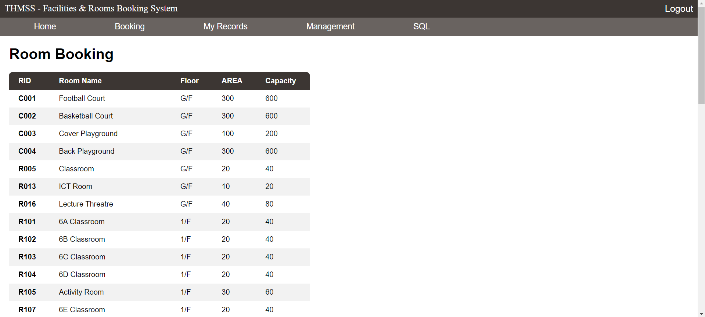
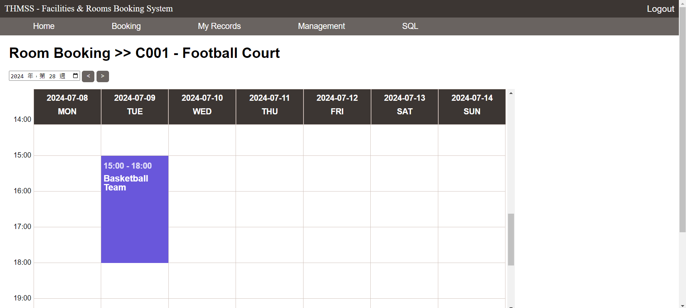
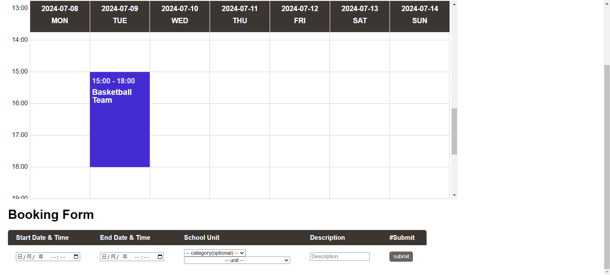

# Introduction
A website server for facilities and rooms booking.

# Content
1. [How-to-Get-Started](#how-to-get-started)
2. [Website-Guide](#website-guide)
3. [Folders](#folders)


# How-to-Get-Started

**Make sure you have installed Python with 3.10.0 or above, and Pip with version 24.0 or above**

You can get python installer from: [Python 3.10.0](#https://www.python.org/downloads/release/python-3100/)

**Make sure you have installed Module Flask with version 3.0.2 or above**

You can install the required modules with:
```
pip install -r /path/to/requirements.txt
```
You can also specify the hosting IP address and PORT in `setting.py`

## Start-the-Web-Server
Run the command:
```
python main.py
```
You can browse the web server with: (defa)

Localhost: 127.0.0.1:{ PORT }

LAN: { IP-ADDRESS }:{ PORT }


If you wish to browse through WAN, please change settings in
your router.

# Website-Guide
## Login
You can login by inputting user ID and password.

**Accout for testing:**\
UserID: S190377\
Password: 12345678

## Home
To be updated.

## My records
To be updated.

## Booking

You can book a room/facility by clicking RID of the room/facility.\
You can also sort the table by clicking the field.



You can check the room usage by selecting a week.


You can get more information by clicking the booked session.


You can add a record by filling the form.\
You can filter school units by selecting a category.

**Please note that users who have no permission to edit room/facility records have to let the one who has that permission to approve their booking.**

## Management
**Your account must have a permission to manage the corresponding table.**

You can either delete a row, modify a row or add a row.

## SQL
**This is for administrators only.**

You can have the full control of the database of this website by executing sql commands.

# Folders
## /modules
Useful Python functions for the main program.

## /routes
Python codes for each webpage.

## /templates
Html code for each webpage.

## /static
Static elements for webpages.

## /database
Database files.

## /photos
Photos for this readme.md.
